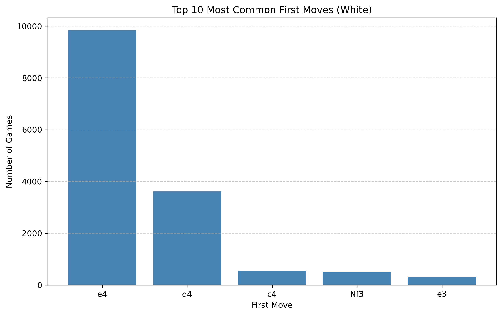
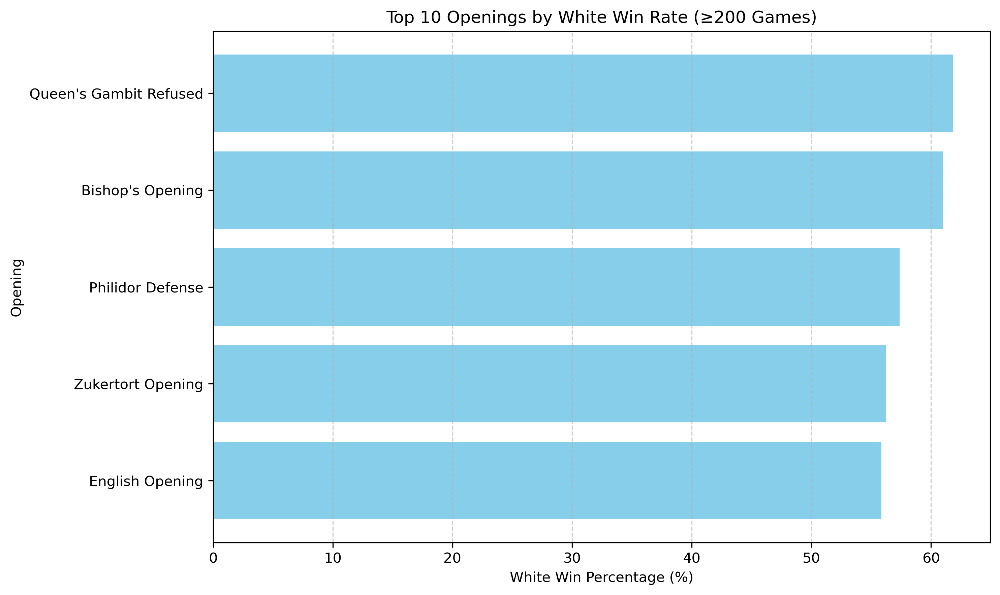
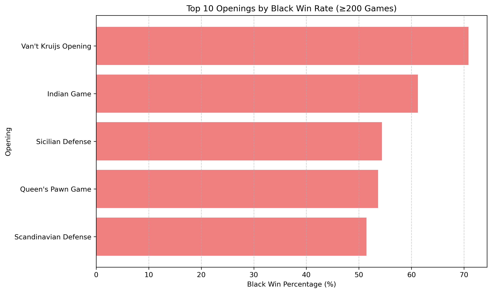
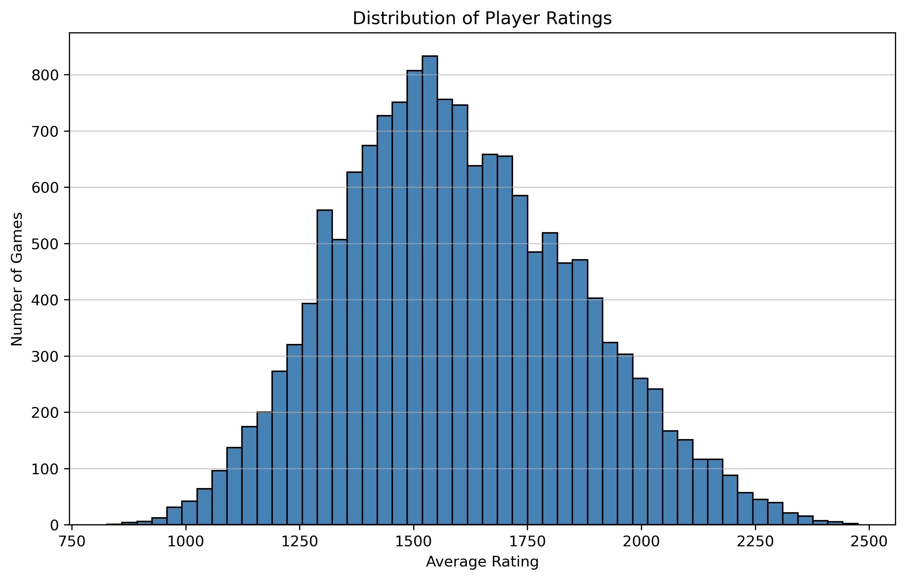
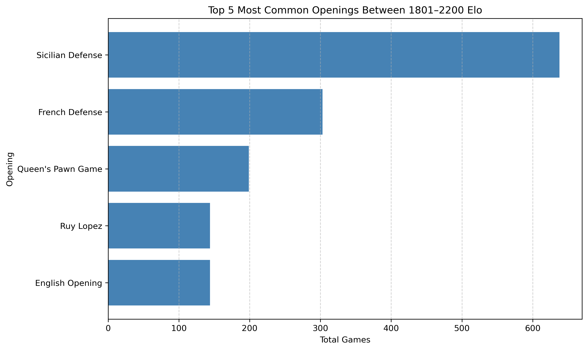
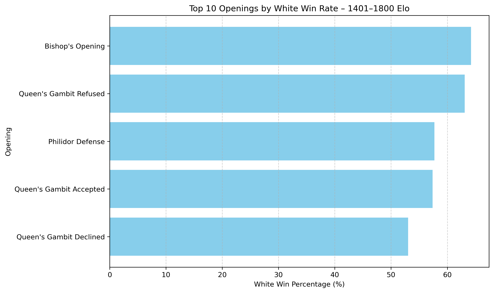
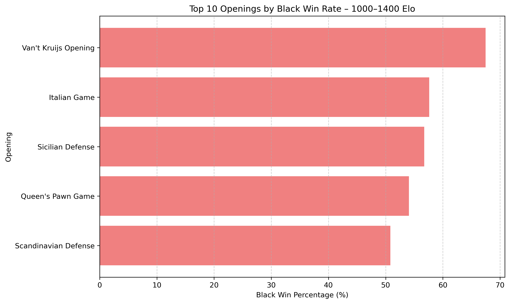
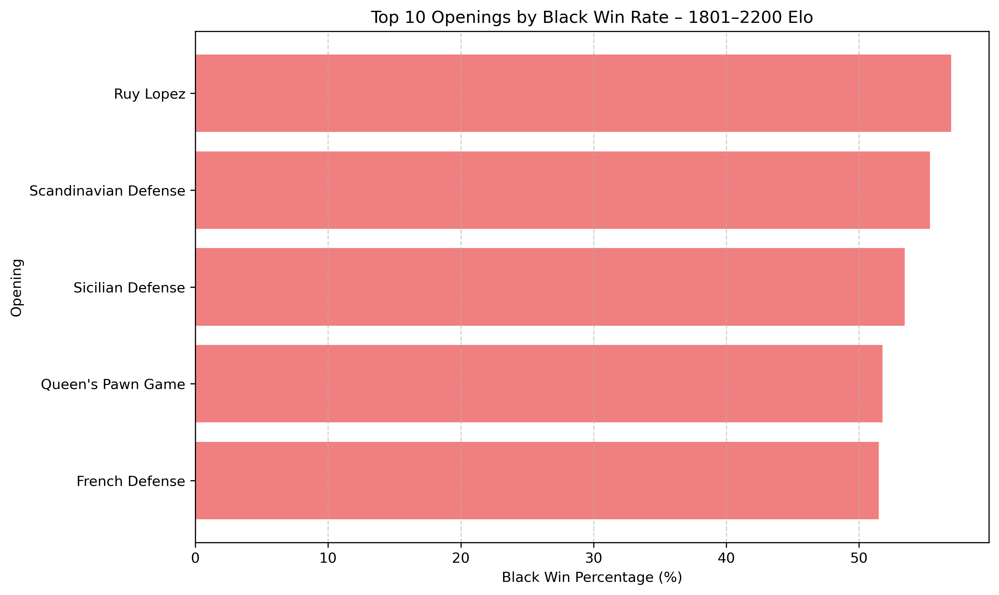
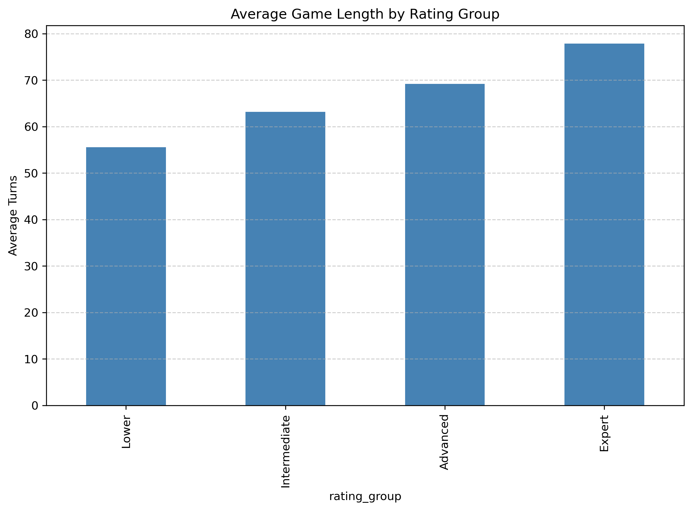
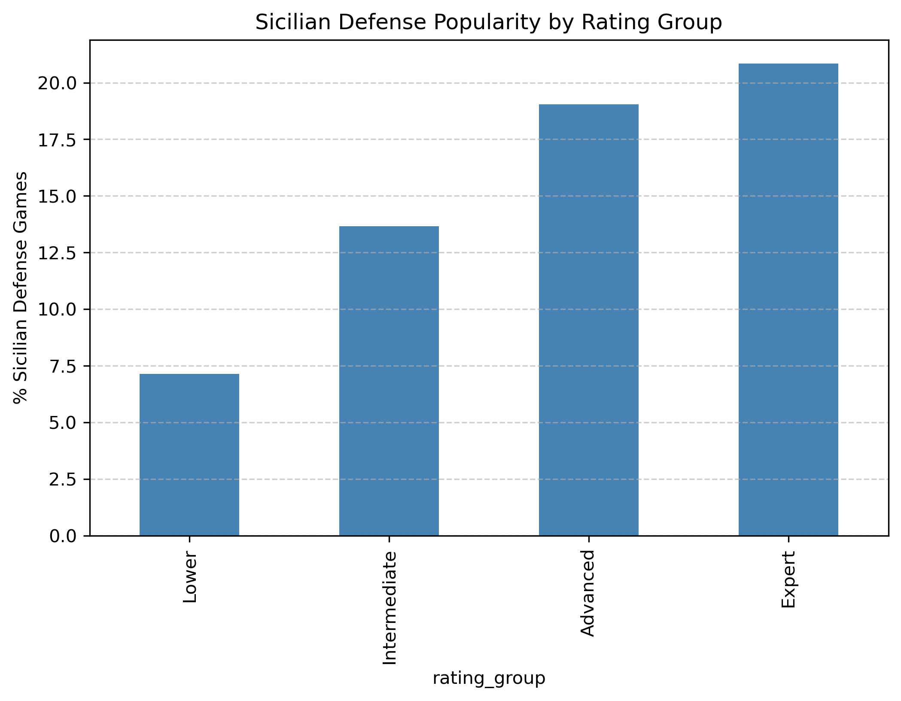

# Overall Trends

### Here we can see that, by far, the Sicilian Defense is the most popular chess opening, which should not come as a suprise. The other common openings being the Italian, French Defense, and Queens Pawn Game was also expected. As for the common first moves, it is no surprise that e4 is more common than d4. The first moves Nf3 and c4 are also up there as they are in common openings such as the Reti and English Opening. The move e3 suprised me as being 5th most common, but it does look like a safe pawn move for beginner players.
### As for the opening winrates, we can see that white does very well in Queens Gambit Declined and the Bishops Opening. These make perfect sense as most lower rated players with the black pieces might not know as nuch about this opening as players with the white pieces. The Bishops Opening is an aggressive opening that can punish early mistakes by black. The most suprising thing in this data is Van Krujis Opening scoring over 70% for black. I am not very familiar with this opening, but I do now that it is a passive line for white, so it makes sense that black can capatalize on it. However, 70% is a massive advantage for black, and might be explained by the low size of the data. 

# Trend Differences Between Rating Groups

### Before we discuss the differences between rating groups it is important to show that the spread of the ratings in the dataset is a bell curve that is centered around 1500-1600. Also, for all of the following results, data is split into 4 different groups: Lower(1000-1400), Intermediate(1400-1800), Advanced(1800-2200), and Expert(2200+). 

### We can gather a couple of insights from these results. First, the Sicilian is the most common opening in all of the rating groups except for the Lower one. This can be expected as the Sicilian is not recommnded for beginners due to its complexity. We can also see that the Scandinavian openings only shows up in this group as well which makes sense because it is a simple, concrete opening to learn. Aside from that, most of the other rating groups had a very similar list which included the Sicilian at the top, and was followed by Queens Pawn, French, and common e4 openings. 

### First, for this data it is important to note that the Expert rating group was not included due to the very small sample size it had compared to the other groups; this small size skews winrates a lot. For the Lower and Intermediate brackets we can see that the highest scoring openings are generally aggressive e4 openings, such as the Italian, Bishops, and Ruy Lopez openings. The Queens Gambit Declined also shows up scoring well. For the advanced bracket, the English opening is the clear top opening, which makes sense because ...... (FILL IN) .........

### The results for blacks opening were somewhat confusing for me to analyze. First, we can see the Van Krujis Opening score indredibly well in the Lower and Intermediate groups. Again, I think that this can be explained by the small sample size of the data, as well as it bein a passive opening for white. I was very suprised to see the Ruy Lopez be the highest winrate for black in the Advanced bracket. I think that the Scandinavian and Sicilian scoring well make sense, as these are very confrontational openings for black. 

# Overall Trends Across Rating Groups 

### In these results we can see a couple of trends that vary by rating. The amount of draws increase as higher rated players generally play more symmetrical and concrete lines, and understand theoretically drawn endgames better. Afterall, perfect chess does result in a draw. The amount of moves in a game increases with rating as higher rated players play longer opening lines and don't make nearly as many early game blunders as lower rated players. Finally, the amount of times the Sicilian is played is correlated with rating, as it is the most complex and theoretically advanced opening in chess. 

